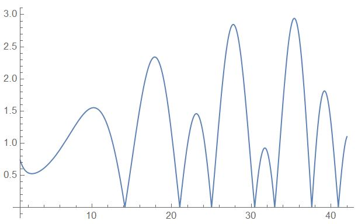

extended_complex
==================

<p align="center">
    <a href="https://github.com/ckormanyos/extended_complex/actions">
        </a>
    <a href="https://codecov.io/gh/ckormanyos/extended_complex" > 
        </a>
    <a href="https://github.com/ckormanyos/extended_complex/blob/main/LICENSE_1_0.txt">
        </a>
    <a href="https://godbolt.org/z/1TMYzfGbh" alt="godbolt">
        </a>
</p>

`ckormanyos/extended_complex` creates an extended complex-number adaption class.
The project is written in header-only C++14, and compatible through C++14, 17, 20, 23 and beyond.

The `extended_complex::complex` template class can be used
with both built-in floating-point types as well as user-defined numeric types.

The complete template signature of the `complex` class is shown below.

```cpp
namespace extended_complex {

// Forward declaration of the complex template class.

template<typename T, typename EnableType = void>
class complex;

} // namespace extended_complex
```

The template parameter `T` is is intended to be a built-in floating-point type
or a user-defined numeric type. The `EnableType` should not be changed.
It is used internally to distinguish built-in floating-point types
from user-defined numeric types.

## Potential Use Cases

There are numerous potential use cases for `ckormanyos/extended_complex`.
These include (but are not limited to) the following and more.

  - Instantiate complex-valued types for user-defined types including multiple-precision types or hardware-emulated types.
  - Perform complex-valued calculations with standard built-in types if STL support for `<complex>` is missing, as may be the case for certain tiny embedded systems.
  - Verify other complex-valued implementations.

## Example

The following straightforward example takes a user-defined,
multiple-precision floating-point type from
[Boost.Multiprecision](https://www.boost.org/doc/libs/1_90_0/libs/multiprecision/doc/html/index.html).
It computes a complex-valued square root with
${\sim}100$ decimal digits of precision.

The square root value computed is

$$
    \sqrt { \frac{12}{10} + \frac{34}{10}i }
$$

$$
{\approx}~1.550088912847258141616{\ldots}~{+}~1.096711282759503047577{\ldots}~i{\text{.}}
$$

The example code is listed in its entirety below. It is also available _live_
at [Godbolt](https://godbolt.org/z/Ezcj8EvT3).

```cpp
#include <extended_complex.h>

#include <boost/multiprecision/cpp_dec_float.hpp>

#include <iomanip>
#include <iostream>

namespace local
{
  template<typename NumericType>
  auto is_close_fraction(const NumericType& a,
                         const NumericType& b,
                         const NumericType& tol = std::numeric_limits<NumericType>::epsilon() * 64) noexcept -> bool
  {
    using std::fabs;

    return (fabs(1 - (a / b)) < tol);
  }
} // namespace local

auto main() -> int
{
  using multiprecision_float_type = boost::multiprecision::number<boost::multiprecision::cpp_dec_float<100>, boost::multiprecision::et_off>;

  using complex_type = extended_complex::complex<multiprecision_float_type>;

  using real_type = typename complex_type::value_type;

  const complex_type val_z1(real_type(12U) / 10U, real_type(34U) / 10U);

  const complex_type sqrt_result { sqrt(val_z1) };

  const real_type ctrl_real { "+1.5500889128472581416161256546038815669761567486848749301860666965618993040312647033986371788677357208" };
  const real_type ctrl_imag { "+1.096711282759503047577277387056220643003106823143745046422869808875853261131777962620301480493467395" };

  const auto result_is_ok = (   local::is_close_fraction(sqrt_result.real(), ctrl_real)
                             && local::is_close_fraction(sqrt_result.imag(), ctrl_imag));

  // Visualize if the result is OK.
  std::stringstream strm { };

  strm << std::setprecision(static_cast<std::streamsize>(std::numeric_limits<real_type>::digits10))
       << sqrt_result;

  // Print the result-OK indication.
  strm << "\nresult_is_ok: " << std::boolalpha << result_is_ok;

  std::cout << strm.str() << std::endl;
}
```

## In-Depth Example

### Complex-Valued Riemann-Zeta Function

Consider the
[Riemann-Zeta function](https://en.wikipedia.org/wiki/Riemann_zeta_function).
It is defined as

$$
{\zeta}\left( s \right)=\sum_{n=1}^{\infty}\frac{1}{n^s}{\text{.}}
$$

An in-depth, non-trivial [example](https://github.com/ckormanyos/extended_complex/blob/main/example/example023_riemann_zeta_z.cpp)
provides a header-only, multiprecision
[implementation](https://github.com/ckormanyos/extended_complex/blob/main/example/zeta_detail.h)
of the complex-valued Riemann-Zeta function.
The complex-valued Riemann-zeta function has one simple pole at $1$.

The program handles arguments in a relatively large (yet limited)
unit disc of radius ${\sim}~{10}^{6}$ in ${\mathbb{C}}$.
This example uses the algorithm described and found in
the [`e_float`](https://doi.acm.org/10.1145/1916461.1916469)
code and paper. See also [1] in the references below.

In particular, the value of

$$
{\zeta}{\Bigl(}\frac{11}{10} + \frac{23}{10}i{\Bigr)}
$$

$$
{\approx}~0.632109498389343535342{\ldots}~{-}~0.265505793636743413620{\ldots}~i
$$

is calculated.

### Number Theory and Zeros on the Critical Line

The complex-valued Riemann-Zeta function plays a central role
in number theory.

The so-called _critical_ _strip_ refers to the region in the complex plane
for which the argument $z$ of the complex-valued Riemann-Zeta
function ${\zeta}(z)$ is

$$
z={\sigma}~+~it{\mbox{,}}
$$

where $0~<{\sigma}~<1$.

It is believed that there are infinitely many non-trivial roots (zeros)
of the complex-valued Riemann-Zeta function. It is, in fact,
thought that the critical strip contains _all_ of these non-trivial zeros.
Note that negative, even integer zeros are considered trivial.

This characteristic of the Riemann-Zeta function forges deep connections
to both prime numbers as well as analytical and theoretical number theory.

The [Riemann Hypothesis](https://en.wikipedia.org/wiki/Riemann_hypothesis),
for instance, states that _all_ non-trivial zeros
of the Riemann zeta function are localized even further
and lie on the _critical_ _line_ at ${\sigma}~=~1/2$.
The statement of the Riemann Hypothesis is profoudly significant
due to its inate implicative and symbiotic relation to prime numbers
and the distribution of prime numbers.

The bold conjecture of the Riemann Hypothesis remains unproven
despite significant efforts by mathematicians to prove it.

The graph below visualizes the absolute value of the complex-valued
Riemann-Zeta function on a small segment of the critical line.
The first $7$ non-trivial zeros are visible.



This image showing $\vert\zeta(z)\vert$ on a small segment of
the critical line has been obtained from
[WolframAlpha(R)](https://www.wolframalpha.com/input?i=Plot%5BAbs%5BZeta%5B%281%2F2%29+%2B+%28I+t%29%5D%5D%2C+%7Bt%2C+1%2C+42%7D%5D)
using the following command.

```wl
Plot[Abs[Zeta[(1/2) + (I t)]], {t, 1, 42}]
```

In [example023a_riemann_zeta_zeros.cpp](https://github.com/ckormanyos/extended_complex/blob/main/example/example023a_riemann_zeta_zeros.cpp),
the first $7$ non-trivial zeros of the complex-valued Riemann-Zeta function on the critical line
are calculated to ${\sim}~501$ decimal digits of precision.
Root finding uses the implementation of
[Algorithm 748](https://doi.org/10.1145/210089.210111)
found in [Boost.Math](https://www.boost.org/doc/libs/1_90_0/libs/math/doc/html/index.html).
See also [2] in the references below.

The results found are:

$$
t_{0}~{\approx}~14.134725141734693790457251983562470270784257115699{\ldots}
$$

$$
t_{1}~{\approx}~21.022039638771554992628479593896902777334340524902{\ldots}
$$

$$
t_{2}~{\approx}~25.010857580145688763213790992562821818659549672557{\ldots}
$$

$$
t_{3}~{\approx}~30.424876125859513210311897530584091320181560023715{\ldots}
$$

$$
t_{4}~{\approx}~32.935061587739189690662368964074903488812715603517{\ldots}
$$

$$
t_{5}~{\approx}~37.586178158825671257217763480705332821405597350830{\ldots}
$$

$$
t_{6}~{\approx}~40.918719012147495187398126914633254395726165962777{\ldots}
$$

The colorful image below depicts an RGB phase portrait of the complex-valued
Riemann-Zeta function. It includes the region of the first $7$ non-trivial zeros
of the Riemann-Zeta function. These are the same ones that are calculated to high precision
in this example. This phase-plot has been computed with a separate program
not present in this repository, and traditional double-precision values
have been used for the phase calculations.

The positions of the non-trivial zeros on the critical line at ${\sigma}~=~1/2$
can easily be recognized in the right-hand side of the picture
at positive values of the complex part of the argument. Each zero
can be located near the rounded edges of the endpoint of its corresponding,
slightly curved-up bar-like form. The image shown below is similar
to the one shown in Fig. 5.1 of [4]. The image here, however,
has slightly different coordinates and also uses the opposite RGB phase convention,
going clockwise through the color wheel.


### _Not_ Number-Theory-Ready

The range and domain of the Riemann-Zeta calculations
in the particular examples described above are designed
for high-precision investigations within the above-mentioned unit-disc
of radius ${\sim}~{10}^{6}$ in ${\mathbb{C}}$.

These are _not_ intended for finding record-breaking,
relatively low-precision counts of zero-crossings
on the critical line at ${\sigma}=1/2$.
These are valuable for providing empirical evidence
for prime number investigations in number-theory.
Other algorithms are needed for this type
of number-theoretical research. See also [3]
for a summary of these methods and a recent
record-breaking calculation.

## Testing

A small test program exercises a variety of non-trivial
algebraic and elementary-function values. The test program verifies
the extended-complex class for both built-in floating point types
`float`, `double` and `long double` as well as a $100$-decimal digit type
from [Boost.Multiprecision](https://www.boost.org/doc/libs/1_90_0/libs/multiprecision/doc/html/index.html).
The above-mentioned in-depth Riemann-Zeta examples are also executed
and verified in the tests.

These in-depth, combined test suites are used in CI
to verify the expected functionality.
They are also employed to obtain
[code coverage results](https://app.codecov.io/gh/ckormanyos/extended_complex).

## Continuous Integration

Continuous integration runs on Ubuntu and MacOS with both GCC/clang
and also runs on Windows with MSVC. GCC's run-time
[sanitizers](https://gcc.gnu.org/onlinedocs/gcc/Instrumentation-Options.html)
are also used in CI in order to help assure dynamic quality.
CI uses the develop branch of modular-boost, when needed,
for multiprecision types and root-finding.

## Additional details

`ckormanyos/extended_complex` has been tested with numerous compilers,
including target systems ranging from eight to sixty-four bits.
The library is specifically designed for dualistic efficiency and portability.

### Configuration macros (compile-time)

Various configuration features can optionally be
enabled or disabled at compile time with compiler switches.
These are described in the following paragraphs.

```cpp
#define EXTENDED_COMPLEX_DISABLE_IOSTREAM
```

When working with even the most tiny microcontroller systems,
I/O-streaming can optionally be disabled with the compiler switch
`EXTENDED_COMPLEX_DISABLE_IOSTREAM`. The default setting is
`EXTENDED_COMPLEX_DISABLE_IOSTREAM` not set and I/O streaming
operations are enabled.

```cpp
#define EXTENDED_COMPLEX_USE_CPP_BIN_FLOAT
```

This macro is used in the associated tests and examples
in order to instantiate the `extended_complex::complex` template class
with the `cpp_bin_float` big-number backend from
[Boost.Multiprecision](https://www.boost.org/doc/libs/1_90_0/libs/multiprecision/doc/html/index.html),
instead of the default `cpp_dec_float`.
Even though the exact big-number floating-point type is not
specifically mentioned in the single-header implementation file
of the `extended_complex::complex` template class, the definition of this
macro can be found there. It is commented out by default and is present
for convenient manual use when desired but not has not explicitly been
set through the compiler command line. When building on the command line,
this macro can be optionally set via `-DEXTENDED_COMPLEX_USE_CPP_BIN_FLOAT`
(i.e., for GCC-like compilers).

```cpp
#define EXTENDED_COMPLEX_CONSTEXPR constexpr
```

The macro `EXTENDED_COMPLEX_CONSTEXPR` is default-defined to be equal
to the word `constexpr`. This macro was previously used (for old compilers
no longer supported) to either use or un-use the word `constexpr`.
This was back when `constexpr` was relatively new. At this time,
simply leave this macro unchanged. It is default-set to the word `constexpr`
and this is not intended to be changed.

## References

[1] C.M. Kormanyos,
_Algorithm_ _910_: _A_ _Portable_ _C++_ _Multiple_-_Precision_ _System_ _for_ _Special_-_Function_ _Calculations_,
ACM Transactions on Mathematical Software, Vol. 37, Issue 4, pp 1-27 (01 February 2011),
[https://doi.org/10.1145/1916461.1916469](https://doi.org/10.1145/1916461.1916469).

[2] G.E. Alefeld, F.A. Potra, Yixun Shi,
_Algorithm_ _748_: _enclosing_ _zeros_ _of_ _continuous_ _functions_,
ACM Transactions on Mathematical Software, Vol. 21, Issue 3, pp 327-344 (01 September 1995),
[https://doi.org/10.1145/210089.210111](https://doi.org/10.1145/210089.210111).

[3] D. Platt and T. Trudgian,
_The_ _Riemann_ _hypothesis_ _is_ _true_ _up_ _to_ ${\mbox{\textit{3}}}{\cdot}{\mbox{\textit{10}}}^{\mbox{\textit{\small{12}}}}$,
[arXiv:2004.09765](https://arxiv.org/pdf/2004.09765.pdf).

[4] E. Wegert,
_Visual_ _Complex_ _Functions:_ _An_ _Introduction_ _with_ _Phase_ _Portraits_,
(Springer/Birkhaeuser, Basel, 2012).
